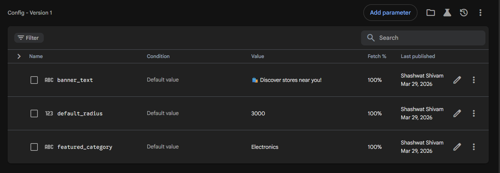
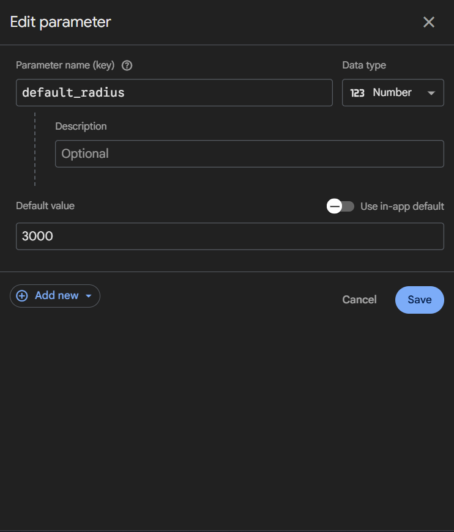
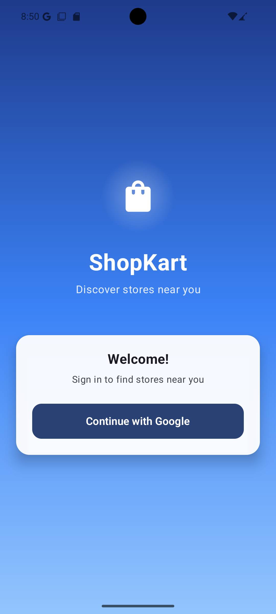
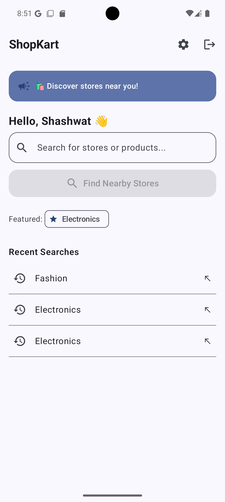
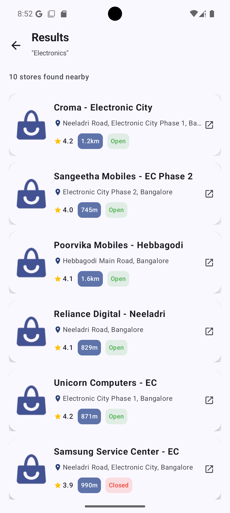
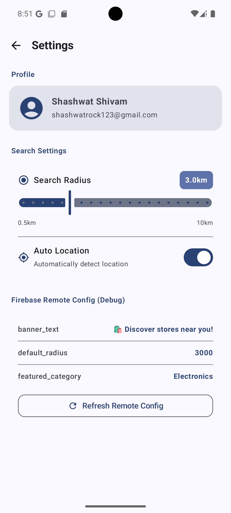

# 🛒 ShopKart

> A location-aware grocery & retail store discovery app for Android, built as a technical assignment using Jetpack Compose, Firebase, and the MVVM architecture pattern.

---

## 📱 Overview

ShopKart lets users discover nearby stores, search by category, and save recent searches — all with a sleek dark-themed UI and seamless Google Sign-In. It was built in 5 days as a technical assignment, navigating real-world challenges like deprecated APIs, Gradle breaking changes, and billing hurdles.

---

## ✨ Features

| Feature | Details |
|---|---|
| 🔐 Google Sign-In | Firebase Authentication with animated dark-themed login screen |
| 🏠 Home Screen | Personalised greeting, search bar, and dynamic banner via Firebase Remote Config |
| 🔍 Store Discovery | Browse stores with ratings, open/closed status, and nearby indicators |
| 🕘 Recent Searches | Persisted locally using Room database |
| ⚙️ Settings | Radius slider, auto-location toggle, Remote Config debug panel |
| 🗺️ Maps Integration | Tap any store card to open it directly in Google Maps |
| 📡 Offline Support | Results cached via Room for offline access |
| 🔒 Secret Management | API keys stored in `local.properties` and exposed via `BuildConfig` — never committed to Git |

---

## 🛠️ Tech Stack

| Layer | Technology |
|---|---|
| Language | Kotlin |
| UI | Jetpack Compose |
| Architecture | MVVM + Repository Pattern |
| Authentication | Firebase Google Sign-In |
| Remote Config | Firebase Remote Config |
| Local Storage | Room (cache) + DataStore (preferences) |
| Networking | Retrofit (stub) |
| Image Loading | Coil |
| Location | Fused Location Provider |
| Store Data | Mock data (Bangalore stores) |

---

## 📁 Project Structure

```
app/src/main/java/com/yourpackage/shopkart/
│
├── data/
│   ├── local/
│   │   ├── SearchEntity.kt         # Room entity for recent searches
│   │   ├── SearchDao.kt            # DAO for search queries
│   │   └── AppDatabase.kt          # Room database definition
│   │
│   ├── remote/
│   │   ├── PlacesApiService.kt     # Data models (API stub)
│   │   ├── PlacesResponse.kt       # Response wrappers
│   │   ├── RetrofitInstance.kt     # Retrofit stub (not actively used)
│   │   └── MockPlacesData.kt       # Primary store data source (Bangalore)
│   │
│   ├── repository/
│   │   └── StoreRepository.kt      # Data orchestration layer
│   │
│   └── preferences/
│       └── UserPreferences.kt      # DataStore preferences
│
├── viewmodel/
│   ├── AuthViewModel.kt            # Handles Google Sign-In state
│   ├── HomeViewModel.kt            # Home screen logic + Remote Config
│   └── SettingsViewModel.kt        # Settings state management
│
├── ui/
│   ├── navigation/
│   │   └── AppNavigation.kt        # Compose NavHost setup
│   │
│   ├── components/
│   │   └── StoreCard.kt            # Reusable store list item
│   │
│   ├── screens/
│   │   ├── LoginScreen.kt          # Dark theme + animated card UI
│   │   ├── HomeScreen.kt           # Search + banner + recent searches
│   │   ├── ResultsScreen.kt        # Store list with filters
│   │   └── SettingsScreen.kt       # Radius, location, Remote Config
│   │
│   └── theme/
│       └── Theme.kt                # App-wide Material 3 theme
│
└── MainActivity.kt
```

---

## 🚀 Getting Started

### Prerequisites

- Android Studio Hedgehog or later
- JDK 17+
- A Firebase project with **Google Sign-In** enabled
- (Optional) Google Places API key — app runs on mock data without it

### Setup

1. **Clone the repository**
   ```bash
   git clone https://github.com/Sarg3n7/shopkart.git
   cd shopkart
   ```

2. **Add `google-services.json`**  
   Download from your Firebase console and place it in the `app/` directory.

3. **Configure `local.properties`**  
   Add the following to your `local.properties` file (already in `.gitignore`):
   ```properties
   WEB_CLIENT_ID=your_web_client_id_here
   PLACES_API_KEY=your_places_api_key_here
   ```

4. **Sync and Build**  
   Open in Android Studio, let Gradle sync, and run on an emulator or device.

---

## ⚙️ Build Configuration Notes

This project targets AGP 9.1.0, which introduced breaking changes. The following fixes were applied:

- Removed the `kotlin-android` plugin (now built into AGP)
- Switched from `kapt` → **KSP `2.2.10-2.0.2`** for annotation processing
- Added `android.disallowKotlinSourceSets=false` to `gradle.properties`

---

## 🌍 Location & Store Data

Since the Google Places API legacy endpoints were deprecated on **March 1, 2025**, and Google billing setup encountered repeated failures during development, the app uses **realistic mock data** for stores in Bangalore.

- Default coordinates: `12.8460, 77.6817` (Electronic City Phase 2)
- All mock stores are placed near this location
- Distance is shown as **"📍 Nearby"** rather than a calculated value, since aerial (Haversine) distance diverged significantly from actual road distance — this was the most honest UX choice

---

## 🔒 Security

- `WEB_CLIENT_ID` and `PLACES_API_KEY` are stored in `local.properties`
- Exposed at build time via `BuildConfig` fields
- `local.properties` is included in `.gitignore` — secrets are never committed to version control

---

## 🧭 Firebase Remote Config

The app fetches the following keys from Firebase Remote Config at launch:

| Key | Description |
|---|---|
| `banner_text` | Promotional text shown on the Home screen |
| `featured_category` | Default category highlighted to the user |
| `default_radius` | Default search radius (in km) |

The Settings screen includes a **Remote Config debug panel** to inspect fetched values during development.

---

## 📸 Screenshots

### Firebase Console

| Firebase Remote Config — Parameters List | Firebase Remote Config — Version History |
|---|---|
|  |  |

### App Screens

| Login Screen | Home Screen | Results Screen | Settings Screen |
|---|---|---|---|
|  |  |  |  |

---

## 🗺️ Roadmap / Known Limitations

- [ ] Replace mock data with live Google Places API once billing is resolved
- [ ] Add real-time road distance using the Distance Matrix API
- [ ] Implement store detail screen
- [ ] Add category filters on Results screen
- [ ] Write unit tests for ViewModels and Repository

---

## 🤝 Acknowledgements

- [Jetpack Compose](https://developer.android.com/jetpack/compose)
- [Firebase](https://firebase.google.com/)
- [Google Places API](https://developers.google.com/maps/documentation/places/android-sdk)
- [Coil](https://coil-kt.github.io/coil/)

---

## 📄 License

This project was created as a technical assignment and is not intended for production use.